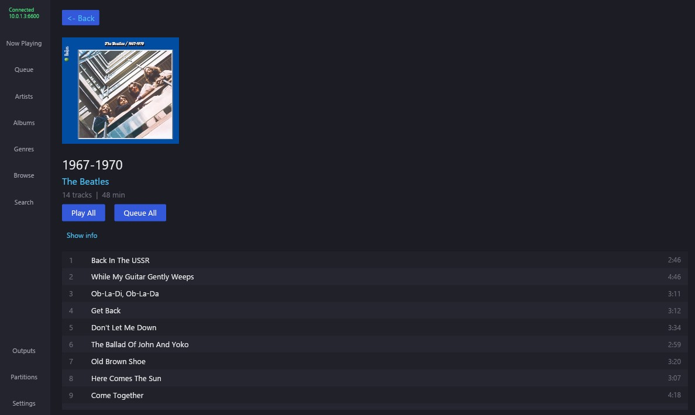
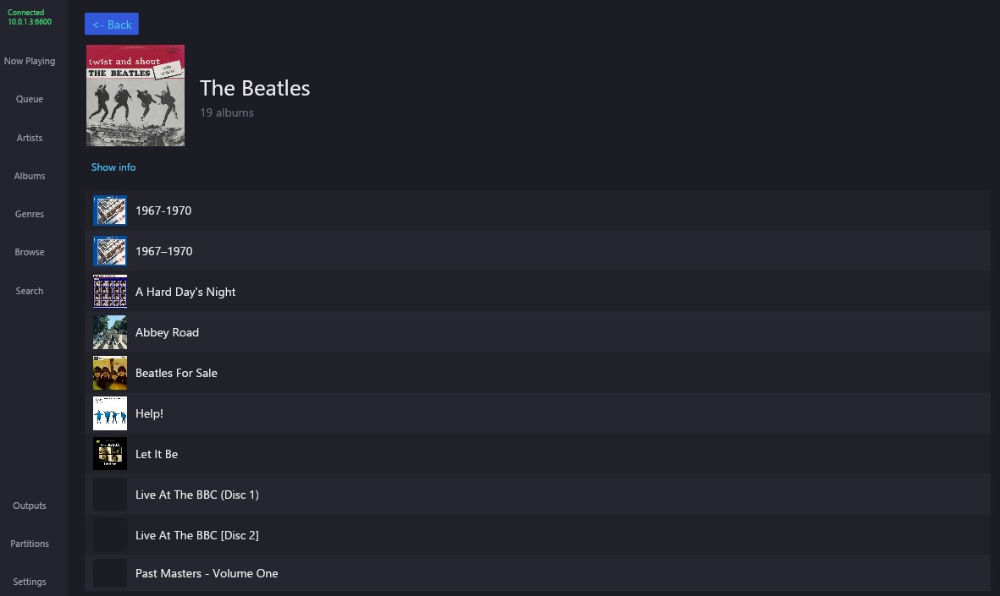
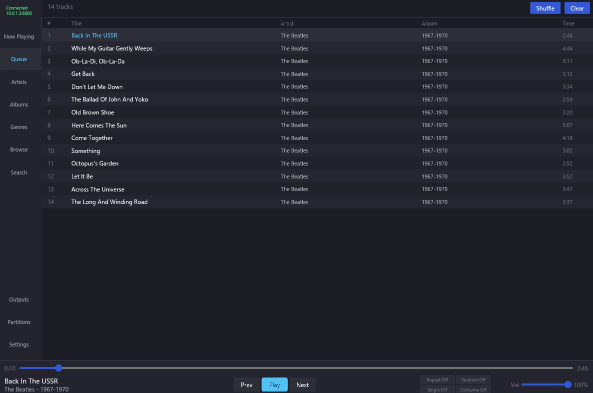
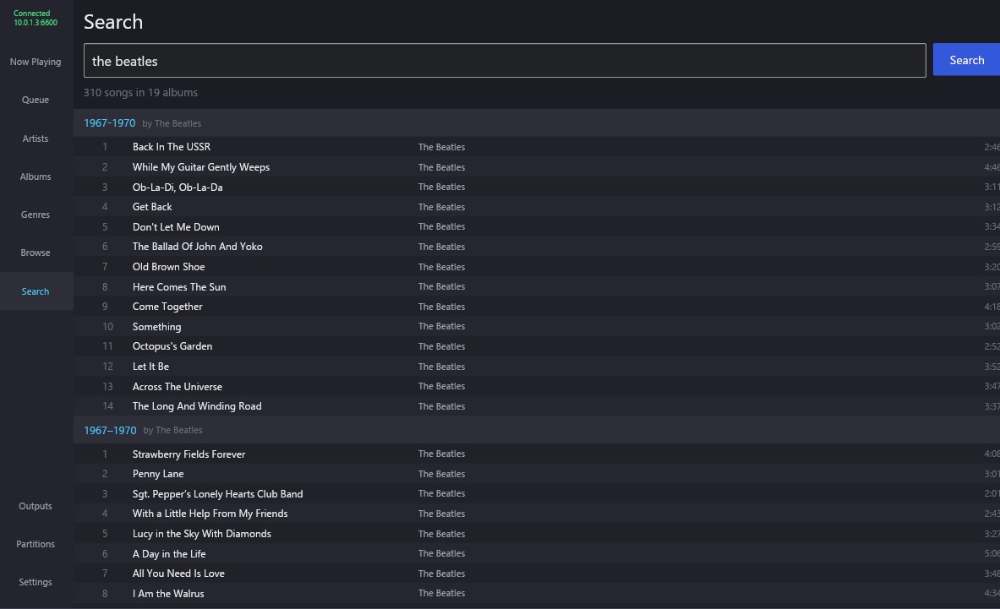
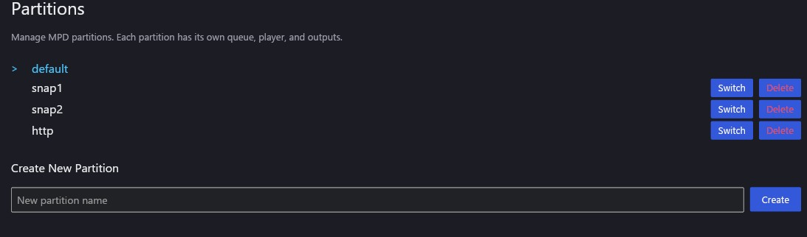
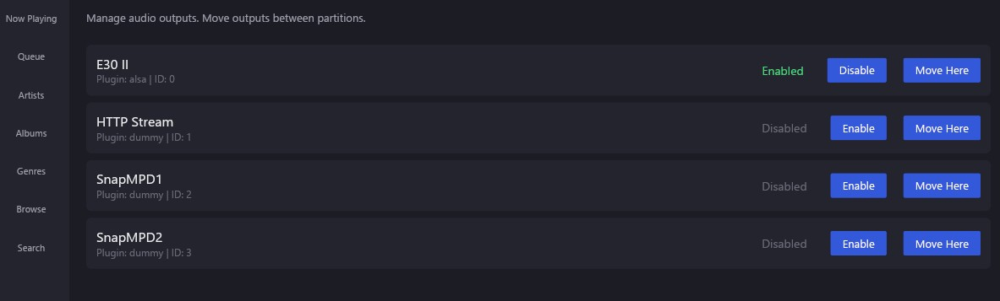

# winrmpc

A modern, native Windows MPD (Music Player Daemon) client built in Rust with the [iced](https://iced.rs/) GUI framework. Runs without a console window; all diagnostic output is accessible through the built-in **Log** view.

## Features

### Music Playback & Control
- Full transport controls: play, pause, stop, previous, next, seek
- Volume control with slider
- Repeat, random, single, and consume mode toggles
- Real-time progress bar with elapsed/total time display
- Now Playing view with album art

### Library Management
- **Artist browsing** with album listings and artist art fetched from MusicBrainz
- **Album browsing** with cover art, track listings, and total duration
- **Genre browsing** with drill-down into albums per genre
- **File/folder browser** — navigate your MPD music directory tree directly
- **Search** — full-text search across your library

### Album & Artist Art
- Art fetched from MPD embedded tags (FLAC, ALAC, MP3, etc.)
- Fallback to **MusicBrainz** and **Cover Art Archive** for album covers
- Artist images sourced from MusicBrainz
- All art cached to disk — fast on subsequent loads

### Wikipedia Integration
- Artist biographies and album descriptions fetched from English Wikipedia via MusicBrainz URL relations
- Expandable info boxes on artist and album detail views

### CD Playback
- Play whole disc or individual tracks
- **Load Tracks** probes the disc and lists tracks with durations
- Optional CD device path in Settings (e.g. `/dev/sr0`) for direct lsinfo support
- Does not request album art for CD tracks, preventing MPD lockups

### Radio
- Built-in Swedish Radio streams (SR P1, P2, P3)
- Add and remove custom stream URLs

### Partitions (Multi-Room Support)
- List, create, and delete MPD partitions
- Switch between partitions; selected partition persists across restarts
- Move audio outputs between partitions

### Audio Outputs
- View all configured MPD audio outputs
- Enable/disable outputs individually
- Move outputs between partitions

### Log View
- All application events visible inside the app under **Log** (below Settings)
- No console window required — runs cleanly as a background-free desktop app
- Clear button to reset the log

## Screenshots

<a href="assets/nowplaying.jpg">
  
</a>
<a href="assets/album.jpg">
  
</a>
<a href="assets/artist.jpg">
  
</a>
<a href="assets/queue.jpg">
  
</a>
<a href="assets/search.jpg">
  
</a>
<a href="assets/partitions.jpg">
  
</a>
<a href="assets/outputs.jpg">
  
</a>

## Building from Source

### Prerequisites

#### 1. Install Rust

Download and install Rust from [https://rust-lang.org/tools/install](https://rust-lang.org/tools/install).

During installation choose **option 1 (default)** which selects the `x86_64-pc-windows-msvc` target.

#### 2. Install Visual Studio Build Tools

Rust on Windows requires the MSVC C++ build tools.

**Option A: Visual Studio Build Tools (smaller download)**
1. Download [Build Tools for Visual Studio 2022](https://visualstudio.microsoft.com/visual-cpp-build-tools/)
2. Run the installer, check **"Desktop development with C++"**, click Install (~1-2 GB)

**Option B: Full Visual Studio**  
Open the **Visual Studio Installer**, click **Modify**, ensure **"Desktop development with C++"** is checked.

> **Note:** Visual Studio *Code* is a different product and does not include the required build tools.

### Build

```bash
git clone https://github.com/mickegris/winrmpc.git
cd winrmpc
cargo build --release
```

The first build downloads all dependencies and compiles everything (several minutes). Subsequent builds are incremental and much faster.

The compiled binary:
```
target\release\winrmpc.exe
```

For development builds (faster compilation):
```bash
cargo build
```

### Verify Rust toolchain

If you encounter linker errors:
```bash
rustup show
```
You should see `stable-x86_64-pc-windows-msvc`. If it shows `gnu`:
```bash
rustup default stable-x86_64-pc-windows-msvc
```

## Configuration

On first launch winrmpc connects to MPD at `127.0.0.1:6600`. Use the **Settings** view (bottom of the sidebar) to change the connection and optionally set a CD device path.

Configuration file:
```
%APPDATA%\winrmpc\winrmpc\config\config.toml
```

Album art cache:
```
%LOCALAPPDATA%\winrmpc\winrmpc\cache\
```

### Example config.toml

```toml
mpd_host = "192.168.1.50"
mpd_port = 6600
# mpd_password = "your_password"
# cd_device = "/dev/sr0"
art_cache_size_mb = 500

[theme]
dark_mode = true
accent_color = "#4fc3f7"
```

## License

MIT

## Acknowledgments

- [iced](https://iced.rs/) — the GUI framework
- [MusicBrainz](https://musicbrainz.org/) — album and artist metadata
- [Cover Art Archive](https://coverartarchive.org/) — album cover art
- [Wikipedia](https://en.wikipedia.org/) — artist and album biographies
