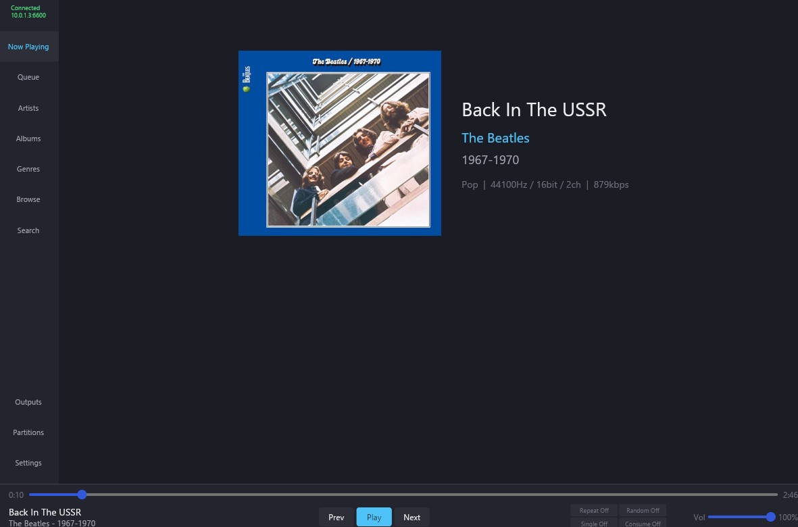

# WinRMPC

A modern, native Windows MPD (Music Player Daemon) client built entirely in Rust with the [iced](https://iced.rs/) GUI framework.

## Features

### Music Playback & Control
- Full playback controls: play, pause, previous, next, seek
- Volume control with slider
- Repeat, random, single, and consume mode toggles
- Real-time progress bar with elapsed/total time display
- Now Playing view with album art

### Library Management
- **Artist browsing** with album listings and artist art fetched from the internet
- **Album browsing** with cover art, track listings, and total duration
- **Genre browsing** with drill-down into albums per genre
- **File/folder browser** — navigate your MPD music directory tree directly
- **Search** — full-text search across your library with results grouped by album
- Clickable navigation: click an artist name on an album to jump to that artist, click an album to see its tracks, etc.

### Album & Artist Art
- Art fetched from MPD embedded tags (FLAC, ALAC, MP3, etc.)
- Fallback to **MusicBrainz** and **Cover Art Archive** for album covers
- Artist images sourced from their most popular album cover via MusicBrainz
- All art cached to disk — fast on subsequent loads
- Art displayed on Now Playing, artist detail, album detail, and search views

### Wikipedia Integration
- Artist biographies fetched from English Wikipedia
- Album descriptions fetched from English Wikipedia
- Expandable info boxes on artist and album detail views
- Results cached in memory for instant subsequent views

### Partitions (Multi-Room Support)
- **Full MPD partition support** — a feature rarely found in MPD clients
- List, create, and delete partitions
- Switch between partitions on the fly
- Each partition has its own independent queue, player state, and audio outputs
- Perfect for **multi-room audio setups** where different rooms play different music from the same MPD instance

### Audio Outputs
- View all configured MPD audio outputs
- Enable/disable outputs individually
- Move outputs between partitions for flexible multi-room routing

## Screenshots

<a href="assets/nowplaying.jpg">
  
</a>


## Building from Source

### Prerequisites

#### 1. Install Rust

Download and install Rust from [https://rust-lang.org/tools/install](https://rust-lang.org/tools/install).

On Windows, this installs `rustup` and `cargo`. During installation, choose **option 1 (default)** which selects the `x86_64-pc-windows-msvc` target.

#### 2. Install Visual Studio Build Tools

Rust on Windows requires the MSVC C++ build tools for linking.

**Option A: Visual Studio Build Tools (smaller download)**
1. Download [Build Tools for Visual Studio 2022](https://visualstudio.microsoft.com/visual-cpp-build-tools/)
2. Run the installer
3. Check **"Desktop development with C++"**
4. Click Install (~1-2 GB download)

**Option B: Full Visual Studio**
1. If you already have Visual Studio 2022 installed, open the **Visual Studio Installer**
2. Click **Modify** on your installation
3. Ensure **"Desktop development with C++"** workload is checked

> **Note:** Visual Studio Code (VS Code) is a different product and does *not* include the required build tools.

### Build

```bash
git clone https://github.com/yourusername/winrmpc.git
cd winrmpc
cargo build --release
```

The first build downloads all dependencies and compiles everything. This takes several minutes. Subsequent builds are incremental and much faster.

The compiled binary will be at:
```
target\release\winrmpc.exe
```

For development builds (faster compilation, slower runtime):
```bash
cargo build
```

### Verify Rust toolchain

If you encounter linker errors, verify your toolchain:
```bash
rustup show
```

You should see `stable-x86_64-pc-windows-msvc` as the active toolchain. If it shows `gnu` instead:
```bash
rustup default stable-x86_64-pc-windows-msvc
```

## Configuration

On first launch, WinRMPC tries to connect to MPD at `127.0.0.1:6600`. Use the **Settings** view (bottom of the sidebar) to change the connection details.

Configuration is stored at:
```
%APPDATA%\winrmpc\winrmpc\config.toml
```

Album art cache is stored at:
```
%LOCALAPPDATA%\winrmpc\winrmpc\cache\
```

### Example config.toml

```toml
mpd_host = "192.168.1.50"
mpd_port = 6600
# mpd_password = "your_password"
art_cache_size_mb = 500

[theme]
dark_mode = true
accent_color = "#4fc3f7"
```

## License

MIT

## Acknowledgments

- [iced](https://iced.rs/) — the GUI framework
- [MusicBrainz](https://musicbrainz.org/) — album and artist metadata
- [Cover Art Archive](https://coverartarchive.org/) — album cover art
- [Wikipedia](https://en.wikipedia.org/) — artist and album biographies
