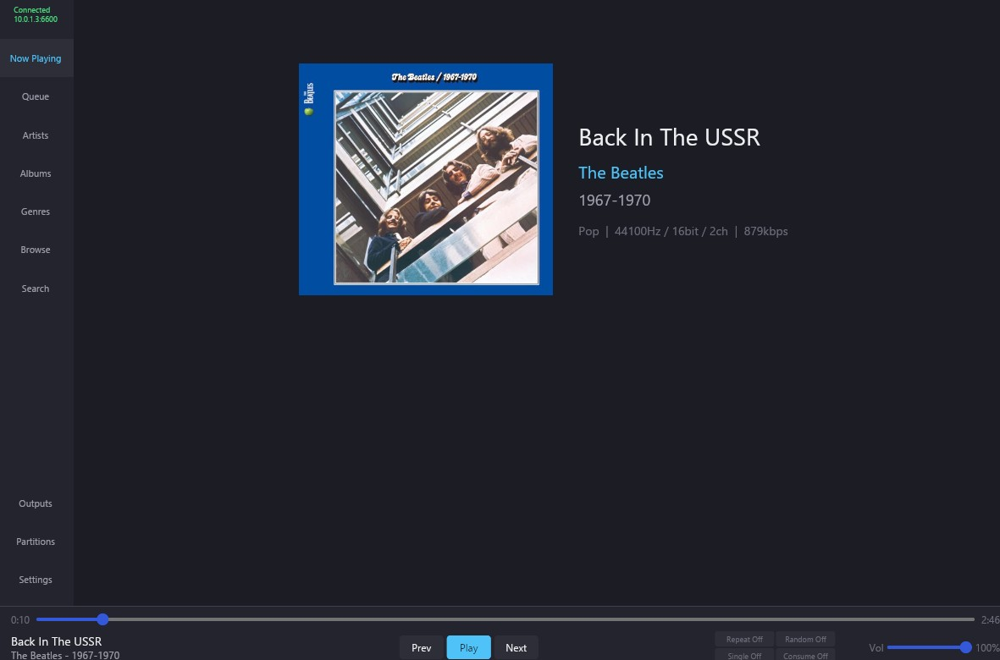
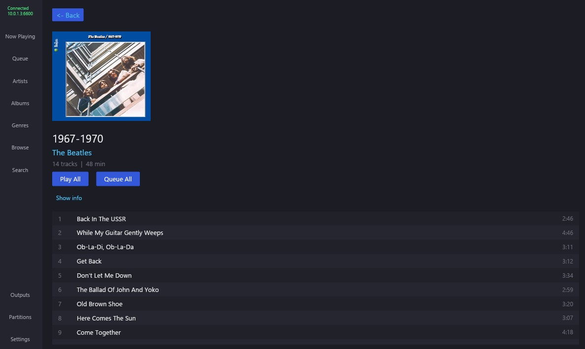
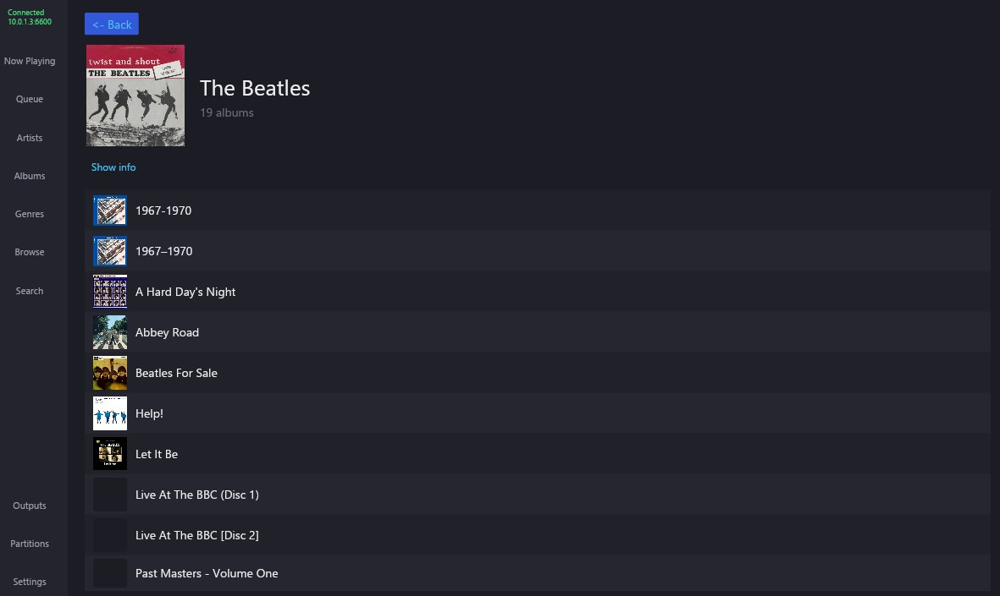
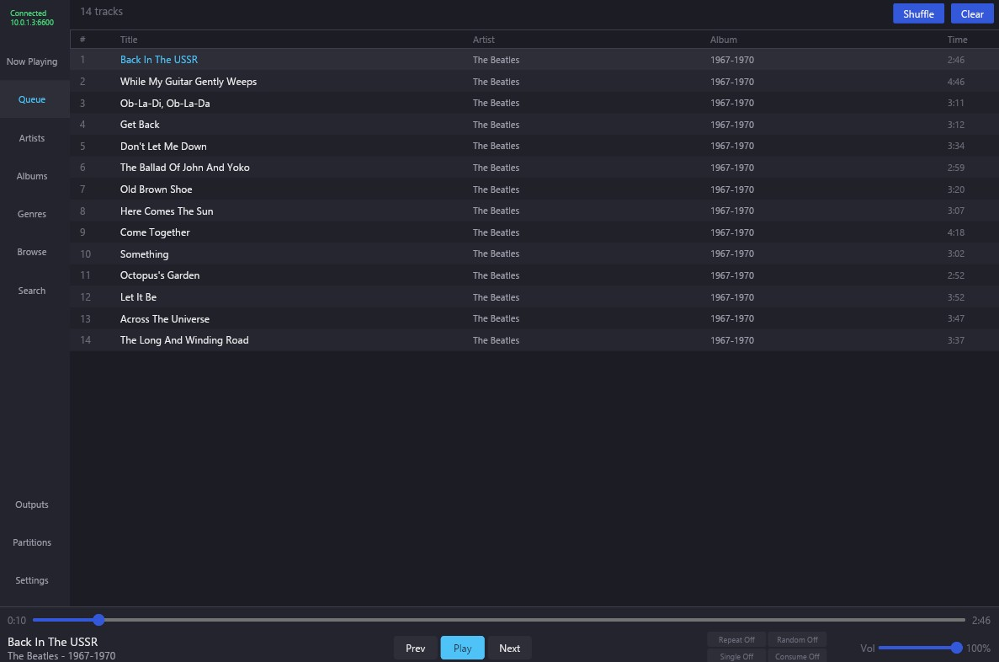
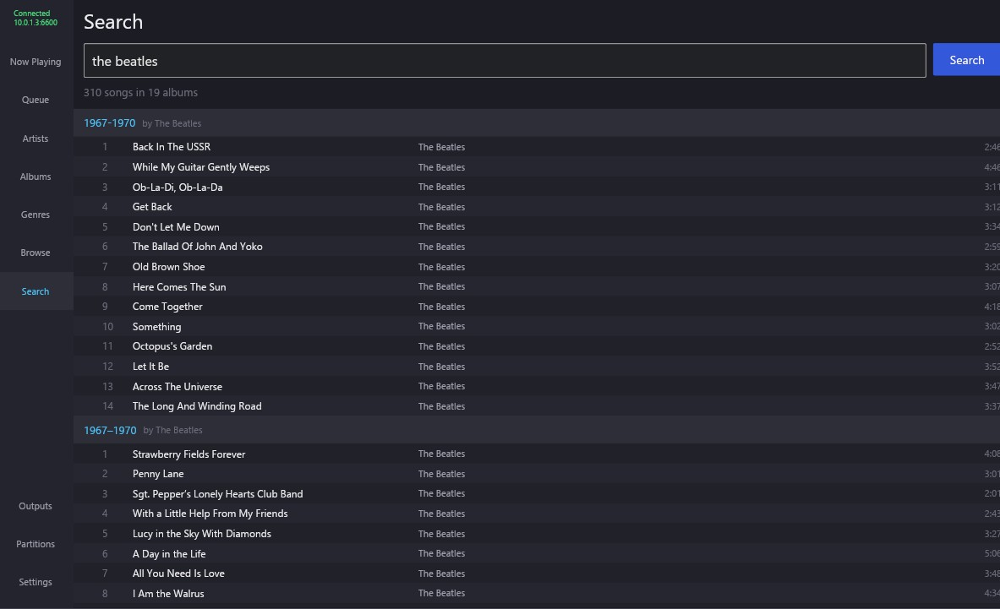
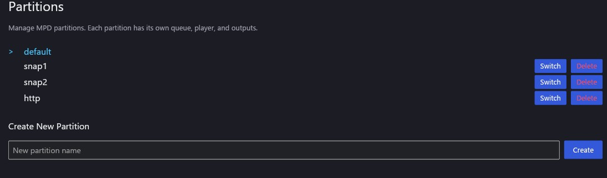
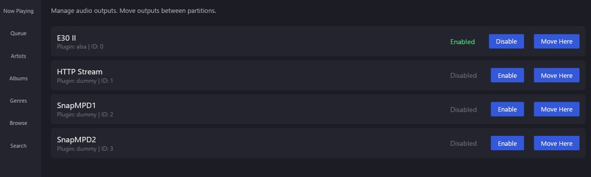

# winrmpc

A modern, native MPD (Music Player Daemon) client built in Rust with the [iced](https://iced.rs/) GUI framework. Runs without a console window; all diagnostic output is accessible through the built-in **Log** view.

## Cross-platform

winrmpc began as a Windows-only project (hence the name — **win**dows **r**ust **mpc**), but the goal is for it to run on every major desktop OS. The codebase is written against cross-platform crates (iced, tokio, directories), so it should build and run fine on **Linux** and **macOS** as well — only the icon embedding and console-hiding are Windows-specific (and are cleanly guarded behind `cfg(target_os = "windows")`).

The name stays `winrmpc` regardless of platform — consider the `win` a historical artifact, not a limitation.

## Features

### Music Playback & Control
- Full transport controls: play, pause, stop, previous, next, seek
- Volume control with slider
- Repeat, random, single, and consume mode toggles
- Real-time progress bar with elapsed/total time display
- Now Playing view with album art
- Crossfade and replay-gain mode toggles right in Now Playing

### Queue
- Reorder tracks up/down, remove individual tracks, clear the queue
- **Play next** — insert a track directly after the one currently playing
- Save the current queue as a stored playlist

### Stored Playlists
- Browse, load, rename, and delete MPD stored playlists
- Reorder and remove tracks within a playlist
- **Add to playlist** picker reachable from Now Playing, albums, the queue, and search

### Lyrics
- Synced and plain lyrics fetched from [LRCLIB](https://lrclib.net/)
- Synced lyrics highlight and auto-scroll in time with playback
- Cached per track, so each song is only fetched once

### History
- **Recently Added** — albums added to the library in the last 30 days
- **Recently Played** — per-server track and album history, kept for 30 days

### Library Management
- **Artist browsing** with album listings and artist art fetched from MusicBrainz
- **Album browsing** with cover art, track listings, and total duration
- **Genre browsing** with drill-down into albums per genre
- **File/folder browser** — navigate your MPD music directory tree directly
- **Search** — full-text search across your library
- **Multi-disc albums collapse into one entry** — `Album [Disc 1]` / `[Disc 2]` show as a single album with all discs, sorted by disc then track. Albums are grouped per artist, so two artists' same-titled albums stay separate

### Album & Artist Art
- Art is looked up in order: **embedded tag → cover file next to the music → internet**
- Fallback to **MusicBrainz** and **Cover Art Archive** for album covers
- Artist images sourced from MusicBrainz
- All art cached in an embedded database with a configurable size cap and LRU eviction — fast on subsequent loads, and "no art exists" is remembered too so it isn't re-fetched every launch

### Wikipedia Integration
- Artist biographies and album descriptions fetched from English Wikipedia via MusicBrainz URL relations
- Expandable info boxes on artist and album detail views

### CD Playback
- Play whole disc or individual tracks
- **Load Tracks** probes the disc and lists tracks with durations
- Optional CD device path in Settings (e.g. `/dev/sr0`) for direct lsinfo support
- Does not request album art for CD tracks, preventing MPD lockups

### Radio
- Built-in Swedish Radio streams (SR P1, P2, P3)
- Add and remove custom stream URLs

### Multiple Servers
- Save several MPD servers and switch between them from Settings
- **Nearby Servers** — discover MPD instances on your LAN over mDNS/Zeroconf and pre-fill the add-server form with one click
- Each server keeps its own partition and play history

### Snapcast Multiroom
- Control a [Snapcast](https://github.com/badaix/snapcast) server alongside MPD
- Per-client volume, per-group mute, and per-group stream selection
- Connects to the same host as MPD on port 1705 by default

### Partitions (Multi-Room Support)
- List, create, and delete MPD partitions
- Switch between partitions; selected partition persists across restarts
- Move audio outputs between partitions

### Audio Outputs
- View all configured MPD audio outputs
- Enable/disable outputs individually
- Move outputs between partitions

### Log View
- All application events visible inside the app under **Log** (below Settings)
- No console window required — runs cleanly as a background-free desktop app
- Every MPD command is timed; anything slower than 2s is flagged with a ⚠
- Clear button to reset the log

### Server Statistics
- Song/album/artist counts, uptime, total playtime, and last database update
- **Update Database** button, disabled while a scan is already running

## Screenshots

<a href="assets/nowplaying.jpg">
  
</a>
<a href="assets/album.jpg">
  
</a>
<a href="assets/artist.jpg">
  
</a>
<a href="assets/queue.jpg">
  
</a>
<a href="assets/search.jpg">
  
</a>
<a href="assets/partitions.jpg">
  
</a>
<a href="assets/outputs.jpg">
  
</a>

## Building from Source

All platforms need **Rust** (stable). Install it from [https://rust-lang.org/tools/install](https://rust-lang.org/tools/install). Then follow the prerequisites for your OS and run the common build step below.

### Windows

Rust on Windows requires the MSVC C++ build tools for linking.

**Option A: Visual Studio Build Tools (smaller download)**
1. Download [Build Tools for Visual Studio 2022](https://visualstudio.microsoft.com/visual-cpp-build-tools/)
2. Run the installer, check **"Desktop development with C++"**, click Install (~1-2 GB)

**Option B: Full Visual Studio**  
Open the **Visual Studio Installer**, click **Modify**, ensure **"Desktop development with C++"** is checked.

> **Note:** Visual Studio *Code* is a different product and does not include the required build tools.

When the Rust installer asks, choose **option 1 (default)**, which selects the `x86_64-pc-windows-msvc` target. If you later hit linker errors, verify the toolchain:
```bash
rustup show          # expect stable-x86_64-pc-windows-msvc
rustup default stable-x86_64-pc-windows-msvc   # if it shows -gnu instead
```

### Linux

Install a C toolchain plus the development headers iced needs for graphics, fonts, and the clipboard. On Debian/Ubuntu:
```bash
sudo apt install build-essential pkg-config \
  libfontconfig1-dev libxkbcommon-dev \
  libwayland-dev libx11-dev
```
On Fedora:
```bash
sudo dnf install gcc pkg-config \
  fontconfig-devel libxkbcommon-devel \
  wayland-devel libX11-devel
```
Rendering uses `wgpu` (Vulkan/GL), so a working GPU driver or a software fallback (e.g. `mesa`) is required at runtime.

### macOS

Install the Xcode Command Line Tools (provides the C toolchain and system frameworks):
```bash
xcode-select --install
```
No other dependencies are needed — Metal is used for rendering.

### Build (all platforms)

```bash
git clone https://github.com/mickegris/winrmpc.git
cd winrmpc
cargo build --release
```

The first build downloads all dependencies and compiles everything (several minutes). Subsequent builds are incremental and much faster.

The compiled binary:
```
target/release/winrmpc        # winrmpc.exe on Windows
```

For development builds (faster compilation, slower runtime):
```bash
cargo build
```

### Running tests

```bash
cargo test                 # run the whole suite
cargo test escape          # run tests whose name matches "escape"
cargo test parse_status -- --exact   # run one specific test
```

The default suite needs **no running MPD server**. It covers the pure-logic
core (command escaping, protocol parsing, album/disc grouping, type
formatting) plus a few tests that drive the Snapcast client against a local
mock socket.

There is also an opt-in set of integration tests that talk to a real server.
They are `#[ignore]`d so they never run by accident, and are enabled by
pointing two environment variables at your own MPD and Snapcast instances:

```bash
WINRMPC_TEST_MPD=192.168.1.50:6600 \
WINRMPC_TEST_SNAPCAST=192.168.1.50:1705 \
  cargo test -- --ignored --test-threads=1
```

These are read-only against your library. The ones that enqueue tracks create
a throwaway MPD **partition**, do their work there, and delete it afterwards,
so your real queue and playback are never touched.

## Configuration

On first launch winrmpc connects to MPD at `127.0.0.1:6600`. Use the **Settings** view (bottom of the sidebar) to add servers and switch between them; the CD device path is set in the **CD** view and the database-update trigger lives in **Stats**.

Configuration file (Windows path shown; Linux and macOS use their own standard config directories):
```
%APPDATA%\winrmpc\winrmpc\config\config.toml
```

Cache database (album art, lyrics, biographies, play history):
```
%LOCALAPPDATA%\winrmpc\winrmpc\cache\winrmpc.redb
```

### Example config.toml

```toml
default_server = "Living Room"
art_cache_size_mb = 500

[[servers]]
name = "Living Room"
host = "192.168.1.50"
port = 6600
# password = "your_password"
# default_partition = "default"
# Snapcast defaults to the same host on port 1705 when these are unset:
# snapcast_host = "192.168.1.50"
# snapcast_port = 1705

[[servers]]
name = "Office"
host = "192.168.1.51"
port = 6600

[theme]
dark_mode = true
accent_color = "#4fc3f7"
```

Older single-server config files are still read and are migrated to the
`[[servers]]` form automatically on first launch.

## License

MIT

## Acknowledgments

- [iced](https://iced.rs/) — the GUI framework
- [MusicBrainz](https://musicbrainz.org/) — album and artist metadata
- [Cover Art Archive](https://coverartarchive.org/) — album cover art
- [Wikipedia](https://en.wikipedia.org/) — artist and album biographies
